# Backend documentation — EcoTrack v1.0

> Версия: 1.0  
> Дата: май 2026  
> Инфраструктура: **Supabase self-hosted** (PostgreSQL, Auth, PostgREST, Kong) в Docker Compose + Vite/React frontend

**Канонический сценарий развёртывания** — вариант **B (локально / self-hosted)**: установка Docker, создание `backend/.env`, `docker compose up`, SQL-миграция, `frontend/.env.local`, запуск и проверка. Всё пошагово описано в корневом **[`Readme.md`](../Readme.md)**; этот файл дополняет его справочником по **HTTP/API** и архитектуре.

---

## Архитектура решения

### Общая схема (вариант B)

```
┌─────────────────┐     ┌──────────────────────────────────────────────┐
│   Frontend      │     │  Supabase self-hosted (backend/docker-compose) │
│   Vite + React  │────▶│  Kong :8000 → Auth, PostgREST, Realtime, …     │
│   supabase-js   │◀────│  PostgreSQL 15                                 │
└─────────────────┘     └──────────────────────────────────────────────┘
```

Браузер обращается к **`VITE_SUPABASE_URL`** (обычно `http://localhost:8000` — это Kong). Отдельного сервера приложений на Node/Express в репозитории нет: данные и Auth идут через официальный стек Supabase.

### Компоненты

| Компонент | Технология | Назначение |
|-----------|------------|------------|
| **Шлюз** | Kong | Единая точка входа, маршрутизация к сервисам |
| **Database** | PostgreSQL | Пользователи (Auth), профили, расчёты, прогресс, рекомендации, логи ошибок |
| **Auth** | GoTrue (Supabase Auth) | Регистрация, вход, JWT |
| **API к таблицам** | PostgREST | REST поверх PostgreSQL (`/rest/v1`) |
| **Security** | Row Level Security (RLS) | Изоляция данных на уровне БД |
| **Client** | `@supabase/supabase-js` v2 | Клиент в React |
| **Клиентские ошибки** | Таблица `client_errors` + `logClientError.ts` | Запись ошибок UI в БД (см. ниже) |

### Зачем self-hosted в этом репозитории

- **Воспроизводимость**: один и тот же Compose и SQL-миграции на любой машине с Docker.  
- **Локальная разработка без облака**: не нужен проект на supabase.co для MVP.  
- **Полный контроль над БД и политиками RLS** в своей среде.

### RLS на таблицах приложения

В **`backend/supabase_migration.sql`** для всех пяти таблиц в `public`, к которым ходит PostgREST, включён **`ENABLE ROW LEVEL SECURITY`**: `profiles`, `calculations`, `user_progress`, `recommendations`, `client_errors`. Без включённого RLS политики не действуют (типичная ошибка старых фрагментов SQL: `CREATE POLICY` на `recommendations` без `ALTER TABLE … ENABLE ROW LEVEL SECURITY`, или отсутствие RLS на `profiles`). Для уже существующей БД выполните **`backend/supabase_security_patch.sql`** (идемпотентно выравнивает RLS, политики и GRANT).

---

## Развёртывание и окружение

Полная инструкция (Docker, `cp .env.example .env`, `utils/generate-keys.sh`, `docker compose up -d`, применение `supabase_migration.sql`, опционально `supabase_security_patch.sql`, frontend `frontend/.env.local`, проверка регистрации и данных) — в **[`Readme.md`](../Readme.md)**.

Кратко, чтобы не дублировать текст:

| Шаг | Где в репозитории |
|-----|-------------------|
| Compose и переменные | `backend/docker-compose.yml`, `backend/.env.example` → локальный `backend/.env` |
| Секреты для первого запуска | `sh utils/generate-keys.sh --update-env` из каталога `backend/` |
| Схема приложения | `backend/supabase_migration.sql` (Studio → SQL Editor на `http://localhost:8000`, Basic Auth: `DASHBOARD_USERNAME` / `DASHBOARD_PASSWORD` из `.env`) |
| Ключ для фронта | значение **`ANON_KEY`** из `backend/.env` → **`VITE_SUPABASE_ANON_KEY`** в `frontend/.env.local` |

Переменные фронта не хранятся в `backend/`; шаблон — **`frontend/.env.example`**.

---

## Скриншоты (пример локальной работы)

Иллюстрации лежат в `backend/screen/` (ошибки авторизации, вход, сохранение данных, Studio, записи в БД).


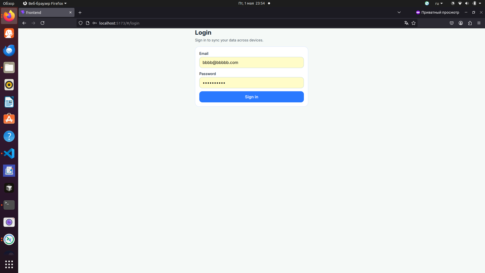


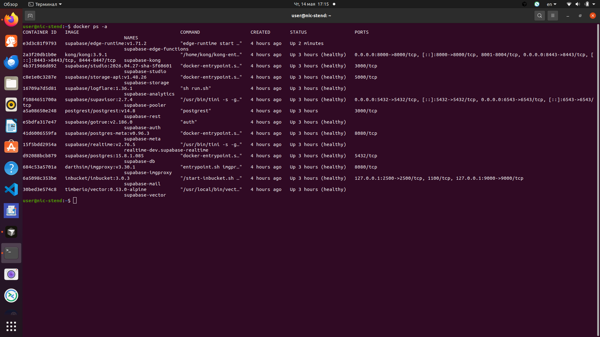

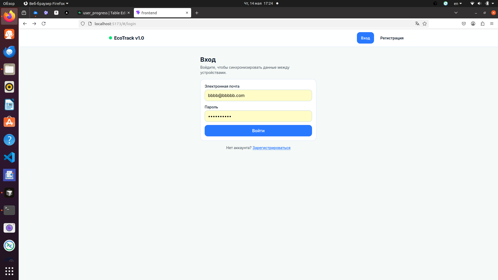

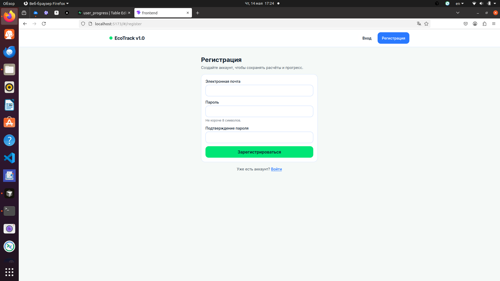

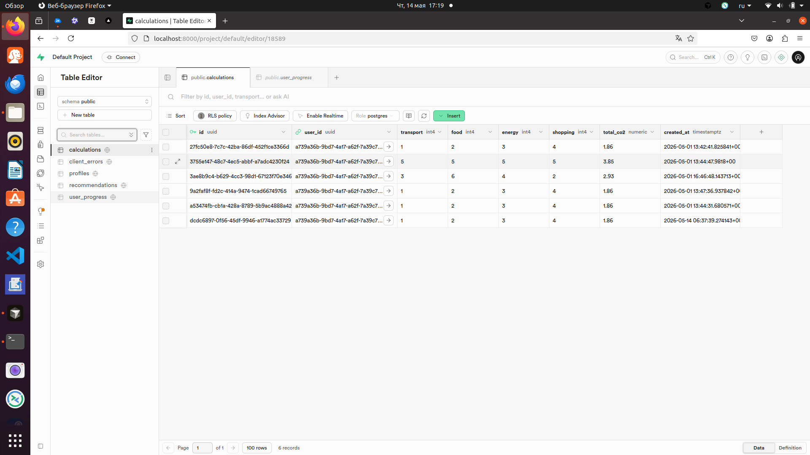

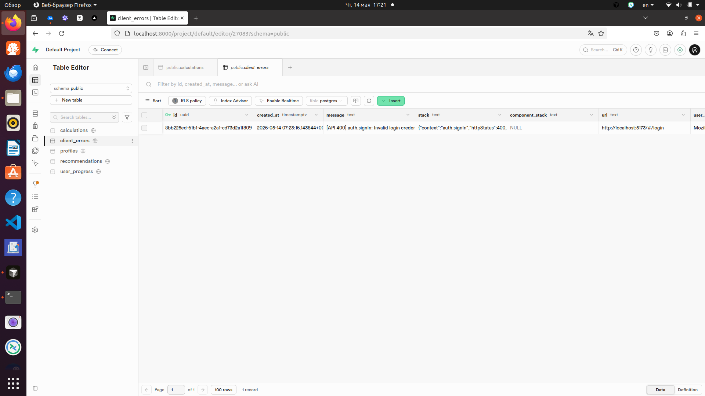


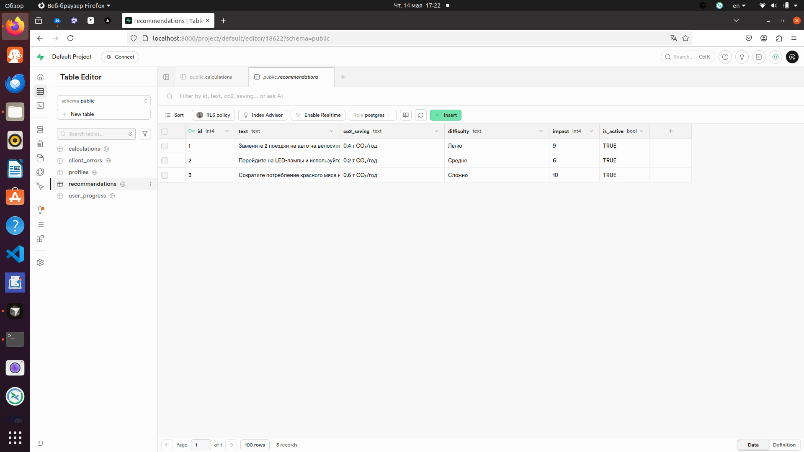


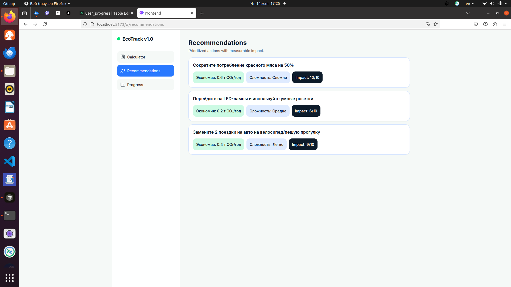

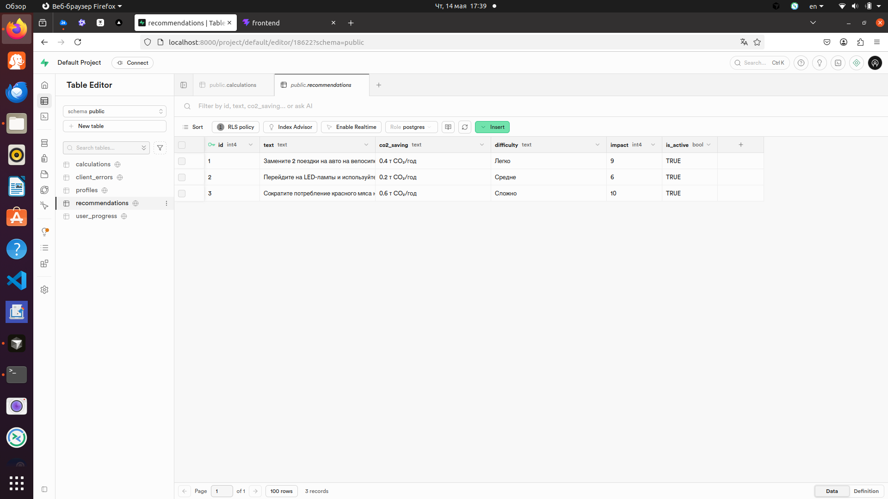

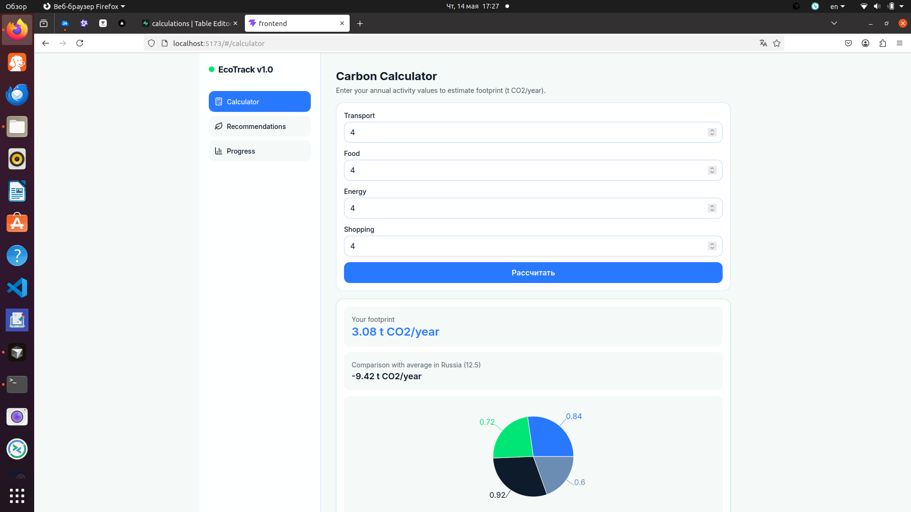

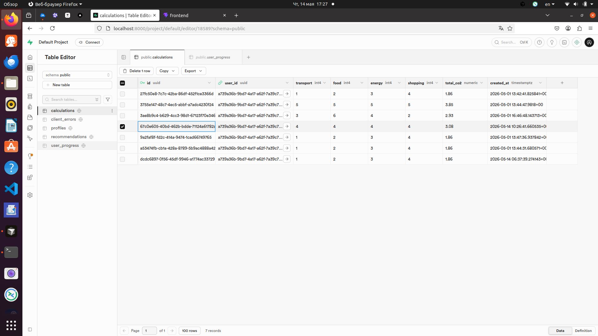

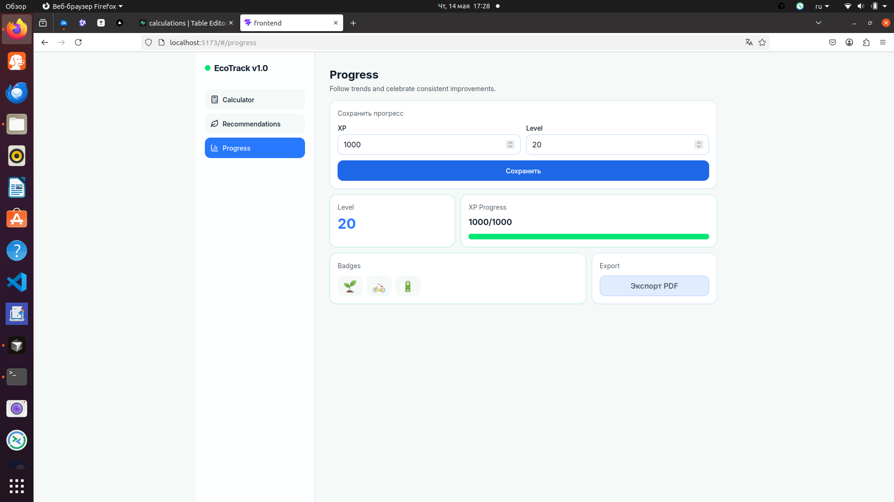


---

## Описание API

Ниже — запросы, которые реально используются в проекте (через Supabase JS → HTTP).

## Базовая информация

- **Тип API:** Supabase (Auth + PostgREST), self-hosted через `backend/docker-compose.yml`
- **Базовый URL API:** `VITE_SUPABASE_URL` (frontend), обычно `http://localhost:8000`
- **Ключ клиента:** `VITE_SUPABASE_ANON_KEY` (должен совпадать с **`ANON_KEY`** в `backend/.env`)
- **Основные префиксы endpoint:**
  - `.../auth/v1/*` — авторизация
  - `.../rest/v1/*` — доступ к таблицам PostgreSQL
  - `.../realtime/v1/*` — realtime (при использовании через SDK)

## Авторизация (Supabase Auth)

### 1) Регистрация

- **Где в коде:** `frontend/src/lib/supabase.ts` (`signUp`)
- **SDK вызов:** `supabase.auth.signUp({ email, password })`
- **HTTP endpoint (под капотом):** `POST /auth/v1/signup`
- **Тело запроса:**

```json
{
  "email": "user@example.com",
  "password": "password123"
}
```

### 2) Вход

- **Где в коде:** `frontend/src/lib/supabase.ts` (`signIn`), используется на странице `frontend/src/pages/Login.tsx`
- **SDK вызов:** `supabase.auth.signInWithPassword({ email, password })`
- **HTTP endpoint (под капотом):** `POST /auth/v1/token?grant_type=password`
- **Тело запроса:**

```json
{
  "email": "user@example.com",
  "password": "password123"
}
```

### 3) Выход

- **Где в коде:** `frontend/src/lib/supabase.ts` (`signOut`)
- **SDK вызов:** `supabase.auth.signOut()`
- **HTTP endpoint (под капотом):** `POST /auth/v1/logout`

### 4) Получение текущего пользователя/сессии

- **Где в коде:** `frontend/src/lib/supabase.ts` (`getCurrentUser`), `frontend/src/hooks/useSession.ts`
- **SDK вызов:** `supabase.auth.getUser()`
- **HTTP endpoint (под капотом):** `GET /auth/v1/user`
- **Авторизация:** `Authorization: Bearer <access_token>`

## Данные приложения (PostgREST)

Все запросы к таблицам идут через Supabase JS и транслируются в HTTP запросы к `.../rest/v1/*`.

### 1) Таблица `calculations`

#### 1.1 Получить последние расчеты пользователя

- **Где в коде:** `frontend/src/hooks/useEcoData.ts` (`useCalculations -> reload`)
- **SDK вызов:**
  - `.from('calculations').select('*').eq('user_id', userId).order('created_at', { ascending: false }).limit(50)`
- **HTTP endpoint (эквивалент):**
  - `GET /rest/v1/calculations?select=*&user_id=eq.<user_id>&order=created_at.desc&limit=50`

#### 1.2 Сохранить расчет

- **Где в коде:** `frontend/src/hooks/useEcoData.ts` (`useCalculations -> saveCalculation`)
- **SDK вызов:**
  - `.from('calculations').insert({...}).select('*').single()`
- **HTTP endpoint (эквивалент):**
  - `POST /rest/v1/calculations?select=*`
- **Тело запроса (пример):**

```json
{
  "user_id": "uuid",
  "transport": 10,
  "food": 20,
  "energy": 30,
  "shopping": 40,
  "total_co2": "100.00"
}
```

### 2) Таблица `user_progress`

#### 2.1 Получить прогресс пользователя

- **Где в коде:** `frontend/src/hooks/useEcoData.ts` (`useProgress -> reload`)
- **SDK вызов:**
  - `.from('user_progress').select('*').eq('user_id', userId).maybeSingle()`
- **HTTP endpoint (эквивалент):**
  - `GET /rest/v1/user_progress?select=*&user_id=eq.<user_id>&limit=1`

#### 2.2 Создать/обновить прогресс (upsert)

- **Где в коде:** `frontend/src/hooks/useEcoData.ts` (`useProgress -> upsert`)
- **SDK вызов:**
  - `.from('user_progress').upsert({...}, { onConflict: 'user_id' }).select('*').single()`
- **HTTP endpoint (эквивалент):**
  - `POST /rest/v1/user_progress?on_conflict=user_id&select=*`
- **Тело запроса (пример):**

```json
{
  "user_id": "uuid",
  "xp": 120,
  "level": 2,
  "badges": ["first_calc"],
  "updated_at": "2026-05-01T16:00:00.000Z"
}
```

### 3) Таблица `recommendations`

#### 3.1 Получить активные рекомендации

- **Где в коде:** `frontend/src/hooks/useEcoData.ts` (`useRecommendations -> reload`)
- **SDK вызов:**
  - `.from('recommendations').select('*').eq('is_active', true).order('id', { ascending: false }).limit(50)`
- **HTTP endpoint (эквивалент):**
  - `GET /rest/v1/recommendations?select=*&is_active=eq.true&order=id.desc&limit=50`

### 4) Таблица `client_errors`

#### 4.1 Логирование клиентских ошибок

- **Где в коде:** `frontend/src/lib/logClientError.ts`
- **SDK вызов:**
  - `supabase.from('client_errors').insert({...})`
- **HTTP endpoint (эквивалент):**
  - `POST /rest/v1/client_errors`
- **Тело запроса (пример):**

```json
{
  "message": "TypeError: ...",
  "stack": "...",
  "component_stack": "...",
  "url": "http://localhost:5173/#/calculator",
  "user_agent": "Mozilla/5.0 ..."
}
```

## Заголовки и авторизация

Типовые заголовки, которые использует Supabase JS:

- `apikey: <VITE_SUPABASE_ANON_KEY>`
- `Authorization: Bearer <access_token>` (для запросов пользователя после входа)
- `Content-Type: application/json`

## Что важно по проекту

- В репозитории **нет** отдельного самописного backend API на Express/FastAPI с маршрутами вида `/api/...`.
- Каталог **`backend/`** — это инфраструктура self-hosted Supabase (Docker Compose) и SQL-артефакты; прикладной трафик идёт из frontend напрямую в Supabase API за Kong.
