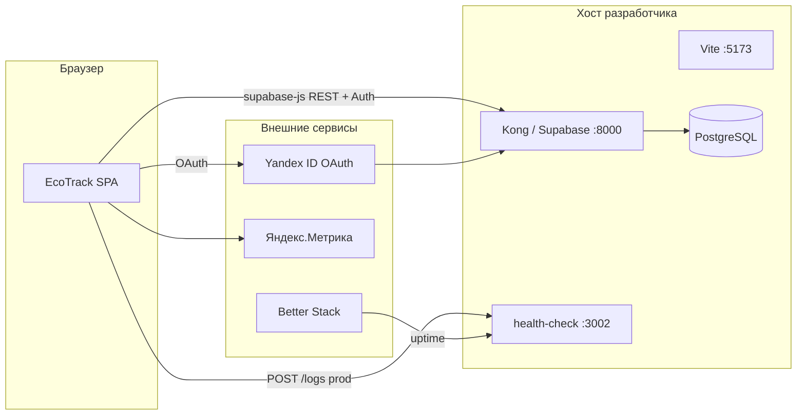

# EcoTrack — интеграционная документация

Краткое описание связки **frontend (React + Vite)** ↔ **backend (self-hosted Supabase в Docker)** ↔ **CI/CD**, OAuth, аналитики, мониторинга и логирования. Подробные инструкции по установке — в [Readme.md](Readme.md).

**Вариант развёртывания:** B — локальный Supabase (PostgreSQL, Auth, PostgREST) через Kong на порту **8000**; отдельного Node API для доменных данных нет.

---

## 1. Архитектура интеграции



| Слой | Технология | Роль |
|------|------------|------|
| Frontend | React 18, Vite, HashRouter | UI, `@supabase/supabase-js` |
| API / Auth | Kong + GoTrue + PostgREST | Единая точка `VITE_SUPABASE_URL` |
| Health | Fastify (`backend/health/`) | `/health`, `POST /logs` |
| Production UI | GitHub Pages | Статический `frontend/dist` |

---

## Локальный режим backend (важно для ревью)

**Backend в этом репозитории не деплоится в GitHub Actions.** Runner GitHub живёт только на время job: после завершения workflow виртуальная машина удаляется вместе с любыми контейнерами. Workflow [`deploy-backend.yml`](.github/workflows/deploy-backend.yml) лишь проверяет, что `docker compose config` и сборка `backend/health` проходят; постоянный Supabase-стек в облаке Actions не поднимается.

**Backend запускается локально** на машине разработчика — по шагам из [Readme.md](Readme.md) (разделы 2–4): `backend/.env`, `docker compose up -d`, SQL-миграции в Studio. Это единственный штатный способ поднять PostgreSQL, Auth (GoTrue), PostgREST и Kong (`http://localhost:8000`) для EcoTrack.

**GitHub Pages отдаёт только статический frontend** (`frontend/dist`). Сборка в CI вшивает в бандл `VITE_SUPABASE_URL` и `VITE_SUPABASE_ANON_KEY` из Secrets/Variables. Полноценный сценарий **end-to-end** (вход, данные, OAuth) с опубликованного Pages работает **только если одновременно**:

1. на вашей (или доступной браузеру) машине **поднят локальный Supabase** (`docker compose` в `backend/`);
2. при последней сборке в Actions были переданы **корректные** `VITE_SUPABASE_URL` (обычно `http://localhost:8000`, если API на той же машине) и `VITE_SUPABASE_ANON_KEY` (= `ANON_KEY` из `backend/.env`, не текст из инструкции);
3. вы открываете Pages **с того же компьютера**, где слушает Kong (для `localhost` в secrets это обязательно — у других пользователей их «localhost» недоступен).

Иначе UI на Pages может открыться, но запросы к API упадут (сеть, CORS, «Supabase не настроен» при пустых secrets при сборке). Для демо ревьюеру: поднять backend по Readme, проверить secrets, перезапустить workflow frontend, открыть project URL `https://<owner>.github.io/<repo>/#/login`.

---

## 2. CI/CD

Два workflow в [`.github/workflows/`](.github/workflows/).

### 2.1. Frontend — Deploy Frontend to GitHub Pages

**Файл:** [`deploy-frontend-pages.yml`](.github/workflows/deploy-frontend-pages.yml)

| Параметр | Значение |
|----------|----------|
| Триггер | `push` в `master` / `main`; `workflow_dispatch` |
| Jobs | `quality` → `build` → `deploy` |
| Результат | Публикация `frontend/dist` на GitHub Pages |

**Job `quality`:** `npm ci` → **`npm run lint`** (ESLint) → `npm run test`. Prettier / `format:check` в проекте **нет** — quality gate только ESLint + Vitest; проверка типов — в job `build` (`tsc -b`).

**Цепочка `build`:** resolve base path (`/{repo}/` для project site) → проверка `VITE_SUPABASE_*` → `npm run build:pages` → проверка вшитых ключей в `dist` → artifact → `deploy-pages`.

**Требования в GitHub:** Settings → Pages → **Source: GitHub Actions**; environment `github-pages`.

### 2.2. Backend — Backend stack (compose check)

**Файл:** [`deploy-backend.yml`](.github/workflows/deploy-backend.yml)

| Параметр | Значение |
|----------|----------|
| Триггер | `push` / `pull_request` при изменении `backend/**` или workflow; `workflow_dispatch` |
| Действия | `docker compose --env-file .env.example config -q`; `npm run build` в `backend/health/` |
| Деплой | **Нет** — runner не хранит Docker-стек после job |

Постоянный хостинг backend — VPS, облако или локальная машина разработчика.

---

## 3. Локальный backend

См. также блок [**Локальный режим backend**](#локальный-режим-backend-важно-для-ревью) выше — связь с CI и GitHub Pages.

Из каталога **`backend/`**:

```bash
cp .env.example .env
sh utils/generate-keys.sh --update-env   # JWT, ANON_KEY, пароли
docker compose up -d
```

| URL | Назначение |
|-----|------------|
| `http://localhost:8000` | Kong — API, Studio (Basic Auth из `DASHBOARD_*` в `.env`) |
| `http://localhost:3002/health` | Health-check (контейнер `health-check`) |
| `http://127.0.0.1:9000` | Inbucket (письма), если отключён autoconfirm email |

**Схема БД (первый запуск):** в Studio (SQL Editor) выполнить `supabase_migration.sql`, затем `supabase_performance_indexes.sql`. При необходимости — `supabase_profile_trigger.sql`, `supabase_security_patch.sql`.

**Остановка:** `docker compose down`

---

## 4. Подключение frontend к backend

Frontend обращается к Supabase **только через HTTP-клиент** [`@supabase/supabase-js`](frontend/src/lib/supabase.ts) — Auth, PostgREST, таблицы приложения.

### 4.1. Локальная разработка

```bash
cd frontend
cp .env.example .env.local
# задать VITE_SUPABASE_URL и VITE_SUPABASE_ANON_KEY
npm install
npm run dev    # http://localhost:5173
```

| Переменная | Значение |
|------------|----------|
| `VITE_SUPABASE_URL` | `http://localhost:8000` (= `SUPABASE_PUBLIC_URL` в `backend/.env`) |
| `VITE_SUPABASE_ANON_KEY` | `ANON_KEY` из `backend/.env` (после `generate-keys.sh`) |

После смены `VITE_*` — перезапуск `npm run dev`.

### 4.2. GitHub Pages

| Переменная | Где задать | Примечание |
|------------|------------|------------|
| `VITE_SUPABASE_URL` | Secret или Variable в Actions | Для чужих браузеров — **публичный** URL API, не `localhost` |
| `VITE_SUPABASE_ANON_KEY` | Secret | Тот же `ANON_KEY`, что в backend |
| `VITE_BASE_PATH` | CI (авто) | `/otus-dev-ai/` для project site |

Пример URL приложения: `https://<owner>.github.io/<repo>/#/login`

Значения **вшиваются при `vite build`** в CI, не подставляются в рантайме на Pages.

---

## 5. OAuth2 (Яндекс)

### 5.1. Поток

1. Пользователь нажимает «Войти через Яндекс» → `supabase.auth.signInWithOAuth({ provider: 'yandex', options })`.
2. `redirectTo` — **без hash**: `{origin}/auth/callback` (локально `http://localhost:5173/auth/callback`; на Pages — `https://…/otus-dev-ai/auth/callback`). См. [`frontend/src/lib/authOAuth.ts`](frontend/src/lib/authOAuth.ts), [`appLocation.ts`](frontend/src/lib/appLocation.ts).
3. Яндекс → GoTrue (`http://localhost:8000/auth/v1/callback`) → редирект на `redirectTo` с `?code=`.
4. `bootstrap.ts` переносит `?code=` в `/#/auth/callback?code=…`; страница [`AuthCallback`](frontend/src/pages/AuthCallback.tsx) обменивает код на сессию (PKCE).

Вход по **email/паролю** использует тот же Supabase Auth, без внешнего OAuth.

### 5.2. Настройка backend (`backend/.env`)

| Переменная | Назначение |
|------------|------------|
| `YANDEX_CLIENT_ID` | ID приложения [Яндекс ID](https://oauth.yandex.ru/) |
| `YANDEX_CLIENT_SECRET` | Пароль приложения |
| `SITE_URL` | Origin фронта, напр. `http://localhost:5173` |
| `ADDITIONAL_REDIRECT_URLS` | Wildcards для `redirect_to` с фронта, напр. `http://localhost:5173/**`, `https://<user>.github.io/<repo>/**` |

**Redirect URI в кабинете Яндекс ID:** `http://localhost:8000/auth/v1/callback` (Kong/GoTrue, не Vite).

После правки `.env`: `docker compose up -d auth --force-recreate`

### 5.3. Типичные сбои

| Симптом | Причина | Действие |
|---------|---------|----------|
| Редирект на `localhost:5173`, сервер не отвечает | Dev-сервер не запущен или `redirect_to` не в allow list → fallback `SITE_URL` | `npm run dev`; проверить `ADDITIONAL_REDIRECT_URLS` |
| «Supabase не настроен» на Pages | Нет secrets при сборке | Задать `VITE_SUPABASE_*` в Actions, пересобрать |
| PKCE / `flow_state` | Двойной exchange, F5 на callback | Не обновлять страницу callback; см. `claimOAuthCodeExchange` |

---

## 6. Аналитика

**Сервис:** [Яндекс.Метрика](https://metrika.yandex.ru)

| Компонент | Файл |
|-----------|------|
| События `reachGoal` | `frontend/src/hooks/useAnalytics.ts` |
| Глобальные ошибки | `frontend/src/lib/errorTracking.ts` |
| Подключение счётчика | `frontend/src/lib/yandexMetrikaInit.ts`, `index.html` |

| Переменная | Где | Обязательность |
|------------|-----|----------------|
| `VITE_YANDEX_METRIKA_ID` | `frontend/.env.local` / GitHub Secret | Опционально локально; без ID скрипт не грузится |

Цели в интерфейсе Метрики — тип **JavaScript-событие**, идентификаторы как в `trackEvent()` (`CalculatorCalculated`, `UserLoggedIn`, …). Список — [`frontend/analytics_goals.md`](frontend/analytics_goals.md).

---

## 7. Мониторинг

| Компонент | Описание |
|-----------|----------|
| **health-check** | Fastify, порт **3002**, `GET /health` — Postgres + статус auth |
| **Better Stack Uptime** | Внешние проверки URL `http://<хост>:3002/health` (интервал ~5 мин), алерты Email |

**Локальная проверка:**

```bash
curl http://localhost:3002/health
# OK: HTTP 200, "status":"ok"
# БД недоступна: HTTP 503, "status":"degraded"
```

Перед первым запуском: `cd backend/health && npm install && npm run build`

---

## 8. Логирование

| Слой | Механизм | Уровни / куда |
|------|----------|----------------|
| **Frontend** | `frontend/src/lib/logger.ts` | dev: консоль + `client_errors`; prod: `warn`/`error` → `POST /logs`, Supabase, буфер `localStorage` |
| **Health** | Pino | `LOG_LEVEL` в `backend/.env`; access-log HTTP |
| **Docker** | json-file stdout | `docker compose logs` |
| **Logtail** (опц.) | profile `monitoring`, `log-aggregator` | `LOGTAIL_SOURCE_TOKEN` в `backend/.env` |

**Таблица `client_errors`** (PostgreSQL) — ошибки UI/API с RLS для authenticated.

---

## 9. Сводка переменных окружения

### Backend (`backend/.env`)

| Переменная | Назначение |
|------------|------------|
| `POSTGRES_PASSWORD`, `JWT_SECRET`, `ANON_KEY`, `SERVICE_ROLE_KEY` | Секреты стека (генерация: `utils/generate-keys.sh`) |
| `SUPABASE_PUBLIC_URL`, `API_EXTERNAL_URL` | `http://localhost:8000` |
| `SITE_URL`, `ADDITIONAL_REDIRECT_URLS` | OAuth redirect |
| `YANDEX_CLIENT_ID`, `YANDEX_CLIENT_SECRET` | Яндекс OAuth |
| `DASHBOARD_USERNAME`, `DASHBOARD_PASSWORD` | Basic Auth Kong / Studio |
| `LOG_LEVEL` | Уровень логов health |
| `LOGTAIL_SOURCE_TOKEN`, `LOGTAIL_HOST` | Better Stack Logtail (опционально) |

### Frontend (`frontend/.env.local`)

| Переменная | Назначение |
|------------|----------|
| `VITE_SUPABASE_URL` | URL Kong |
| `VITE_SUPABASE_ANON_KEY` | `ANON_KEY` |
| `VITE_YANDEX_METRIKA_ID` | Счётчик Метрики (опц.) |
| `VITE_LOGS_API_URL` | `http://localhost:3002/logs` (prod-отправка логов) |

### GitHub Actions (Pages)

| Secret / Variable | Назначение |
|-----------------|------------|
| `VITE_SUPABASE_URL` | URL API для production-бандла |
| `VITE_SUPABASE_ANON_KEY` | Secret, `ANON_KEY` |
| `VITE_YANDEX_METRIKA_ID` | Secret (опц.) |

---

## 10. Проверка работы

### 10.1. Инфраструктура

```bash
# Backend
cd backend && docker compose ps
curl -s http://localhost:3002/health | head -c 200

# Frontend (локально те же проверки, что в CI job quality)
cd frontend && npm run lint && npm run test
npm run dev
```

### 10.2. CI

- Push в `master` → зелёный **Deploy Frontend to GitHub Pages**.
- Push в `backend/**` → зелёный **Backend stack (compose check)**.

### 10.3. Сценарий в браузере (приватное окно)

1. **Регистрация** — `/#/register`, email + пароль (`ENABLE_EMAIL_AUTOCONFIRM=true` — без письма).
2. **Вход** — email/пароль на `/#/login`.
3. **Яндекс** — «Войти через Яндекс» (dev-сервер должен быть запущен; backend и allow list настроены).
4. **Данные** — рекомендации загружаются; расчёт в калькуляторе сохраняется в `calculations` / `user_progress` (проверка в Studio → Table Editor).
5. **Консоль** — нет 401/403 на чтение после входа.

### 10.4. GitHub Pages

1. Secrets заданы (реальный URL, не текст из инструкции).
2. Деплой успешен.
3. Открыть `https://<owner>.github.io/<repo>/#/login` — нет «Supabase не настроен».

### 10.5. При ошибках

| Область | Что сверить |
|---------|-------------|
| Auth / API | `VITE_SUPABASE_*` ↔ `backend/.env` (`ANON_KEY`, URL) |
| OAuth | `SITE_URL`, `ADDITIONAL_REDIRECT_URLS`, Redirect URI в Яндекс ID |
| CI | Лог job `Validate Supabase env`; значения secrets |
| Логи | `docker compose logs auth --tail=50`; таблица `client_errors` в Studio |

---

## Использование AI

По заданию AI (Cursor Agent) использовался для генерации **CI/CD**, **аудита безопасности**, **анализа логов**, оптимизации и интеграционной документации. Ниже — какие задачи решались и **какие промпты** применялись (полный набор шаблонов — в [`promts.md`](promts.md); процесс MVP — в [`development_report.md`](development_report.md)).

**Инструмент:** Cursor IDE, режим Agent, контекст `@Codebase` / `@File` / `@Terminal` где указано.

### Сводка по областям

| Область | Результат в репозитории | Где смотреть |
|---------|-------------------------|-------------|
| CI/CD (frontend) | Workflow Pages: lint → test → build → deploy; проверка `VITE_*` | [`.github/workflows/deploy-frontend-pages.yml`](.github/workflows/deploy-frontend-pages.yml) |
| CI/CD (backend) | Валидация Compose + сборка health (без деплоя стека) | [`.github/workflows/deploy-backend.yml`](.github/workflows/deploy-backend.yml) |
| Аудит безопасности | OWASP, RLS, CSP, `ProtectedRoute`, `security.ts` | [`security_audit.md`](security_audit.md) (Bug-Report) |
| Анализ логов | Root cause, таблицы симптомов, типовые паттерны | [Readme.md — логирование](Readme.md#логирование-отчёт-для-дз), §8 выше |
| Оптимизация | Frontend/backend perf, индексы SQL | [Readme.md — оптимизация](Readme.md#оптимизация-frontend), `backend/supabase_performance_indexes.sql` |
| Интеграция / ДЗ | Этот файл, блок про локальный backend | `integration_documentation.md` |

---

### CI/CD (GitHub Actions)

**Цель:** автоматизировать quality gate и деплой SPA; для backend — только проверка конфигурации, без подъёма Supabase на runner.

**Промпт (генерация и доработка frontend workflow):**

```text
Добавь GitHub Actions для EcoTrack (React + Vite):
1) job quality: npm ci, npm run lint (ESLint), npm run test (Vitest)
2) job build: VITE_SUPABASE_URL и VITE_SUPABASE_ANON_KEY из secrets/vars на этапе vite build,
   npm run build:pages, проверка что ключи вшиты в dist
3) job deploy: GitHub Pages (project site base /{repo}/)
4) workflow_dispatch с опциональным override Supabase env
Prettier в проекте нет — quality gate только ESLint.
Backend в Actions не деплоить — runner одноразовый, Supabase локально через docker compose.
```

**Промпт (backend workflow):**

```text
Создай workflow для backend/: docker compose --env-file .env.example config -q,
сборка backend/health (npm ci && npm run build).
LOGTAIL_SOURCE_TOKEN — заглушка для compose config. Без SSH и без деплоя на runner.
Триггер: push/PR при изменении backend/**.
```

**Что сделал AI:** файлы workflow, скрипты `verify-supabase-build-env.mjs`, `verify-pages-supabase-in-dist.mjs`, `prepare-github-pages.mjs`, шаг `npm run lint`, раздел «Описание настроек CI/CD» в Readme.

---

### Аудит безопасности

**Цель:** OWASP Top 10, зависимости, RLS, XSS/CSRF/SQLi, маршруты без авторизации.

**Промпт:**

```text
@Codebase Проведи аудит безопасности EcoTrack (React + Supabase self-hosted):
1) npm audit в frontend и корне
2) OWASP Top 10: access control, injection, XSS, auth, misconfiguration
3) RLS и GRANT в SQL-миграциях, права anon
4) Клиент: dangerouslySetInnerHTML, localStorage, CSP, ProtectedRoute
5) Таблица: проблема | риск | исправление | файлы
Оформи отчёт в security_audit.md (Bug-Report).
```

**Что сделал AI:** [`security_audit.md`](security_audit.md) — 12 находок с исправлениями; патчи SQL (`supabase_security_hardening.sql` и др.); `frontend/src/lib/security.ts`, `ProtectedRoute`, валидация в `supabase.ts` / `validation.ts`; тесты `security.test.ts`.

---

### Анализ логов

**Цель:** разбор Docker/health/frontend логов, root cause, предложения по коду и недостающим полям логов.

Промпты из [`promts.md`](promts.md) (раздел «Поиск проблем в логах»):

```text
@Terminal docker compose logs -f --tail=500 backend | grep -E "error|warn|500"
Проанализируй выведенные логи:
1. Выдели повторяющиеся ошибки
2. Определи корневую причину (root cause)
3. Предложи конкретные исправления в коде
4. Укажи, какие логи нужно добавить для лучшей диагностики
```

```text
@File: docker-logs.json (скопируйте JSON-логи из docker compose logs --tail=100)
Найди в логах паттерны:
1. Ошибки подключения к БД (P1000, P1001)
2. Ошибки валидации (400, 422)
3. Ошибки аутентификации (401, 403)
4. Таймауты и медленные запросы (>1000ms)
Выведи таблицу: Частота | Уровень | Файл/Роут | Решение
```

**Промпт из Readme (сводный для ДЗ):**

```text
@Codebase Проанализируй docker compose logs --tail=200:
1) повторяющиеся ошибки 2) root cause 3) правки в коде 4) какие логи добавить
```

**Что сделал AI:** структура логирования в Readme (уровни, JSON-схема, `client_errors`, Better Stack); `frontend/src/lib/logger.ts`, `logClientError.ts`; Pino в `backend/health/`; таблица типовых ошибок (OAuth, PGRST, PKCE, health timeout).

---

### Оптимизация (дополнительно)

Из [`promts.md`](promts.md) — использовались при настройке perf-разделов Readme:

| Промпт | Фокус |
|--------|--------|
| `@Codebase` … React lazy, useMemo, Vite chunks, terser, compression | Frontend bundle, Recharts lazy |
| `@Codebase` … N+1, индексы, GZIP, helmet, rate-limit, кэш recommendations | Health + SQL indexes |

---

### Интеграция, OAuth, Pages

Примеры промптов из сессий доработки (не все в `promts.md`):

```text
Исправь редирект GitHub Pages: base path /otus-dev-ai/, assignAppLocation не должен ломать project site.
```

```text
Ошибка Supabase не настроен на Pages — передай VITE_SUPABASE_URL и VITE_SUPABASE_ANON_KEY в GitHub Actions при сборке.
```

```text
При входе через Яндекс редирект на localhost:5173/?code= — исправь ADDITIONAL_REDIRECT_URLS и normalize OAuth callback.
```

```text
Добавь integration_documentation.md: CI/CD, локальный backend, переменные, проверка работы.
Явно опиши: backend не деплоится в Actions, только локальный docker compose.
```

---

### Рекомендуемый паттерн промпта (для ревью)

1. **Контекст** — `@Codebase` / путь к workflow / фрагмент логов.  
2. **Цель** — что должно получиться (файл, green CI, таблица рисков).  
3. **Ограничения** — не ломать email-login, не деплоить backend в GHA, ESLint без Prettier.  
4. **Критерии приёмки** — `npm run lint`, `npm test`, `docker compose config -q`, конкретный URL Pages.

Шаблоны для копирования — в [`promts.md`](promts.md).

---

## Связанные документы

| Документ | Содержение |
|----------|------------|
| [Readme.md](Readme.md) | Полная установка, оптимизация, детали логирования |
| [promts.md](promts.md) | Библиотека промптов: логи, оптимизация frontend/backend |
| [development_report.md](development_report.md) | Промпты и процесс MVP (Calculator, тесты) |
| [security_audit.md](security_audit.md) | Аудит безопасности (OWASP, исправления) |
| [backend/backend_documentation.md](backend/backend_documentation.md) | HTTP API, PostgREST, Auth |
| [frontend/analytics_goals.md](frontend/analytics_goals.md) | Цели Метрики |
| [Readme.md#описание-настроек-cicd](Readme.md#описание-настроек-cicd) | Развёрнутое описание workflow |
